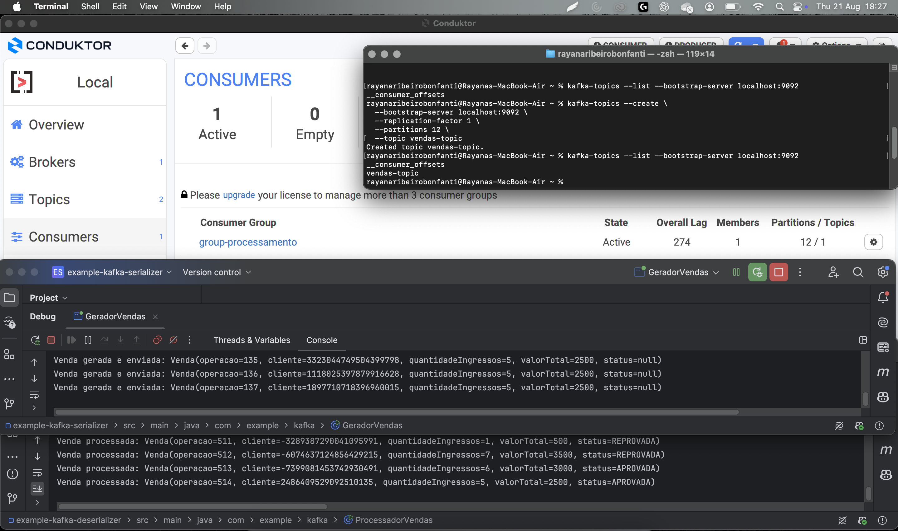

# Projeto de Estudo – Kafka com Java + Conduktor

## Objetivo
O projeto tem como meta entender os conceitos básicos de **produção e consumo de mensagens no Kafka** utilizando **Java puro**, sem frameworks adicionais.  
Além disso, o **Conduktor** foi usado como ferramenta gráfica para visualizar **tópicos, partições, mensagens e grupos de consumidores** em tempo real.

---

## Estrutura do Projeto
1. **Producer (Gerador de Vendas)**  
   - Gera eventos de vendas (simulando um sistema de ingressos).  
   - Cada evento é serializado em JSON e enviado para um tópico Kafka chamado `vendas-topic`.

2. **Consumer (Processador de Vendas)**  
   - Consome as mensagens do `vendas-topic`.  
   - Processa cada venda e atribui um status (`APROVADA` ou `REPROVADA`).  
   - Exibe no console as mensagens processadas.  

3. **Ferramenta de Monitoramento (Conduktor)**  
   - Visualização de **tópicos criados**.  
   - Monitoramento do **consumer group** (`group-processamento`).  
   - Acompanhamento em tempo real das mensagens enviadas e processadas.  

---

## Conceitos Trabalhados
- **Tópico:** Canal de comunicação dentro do Kafka onde as mensagens são publicadas.  
- **Partições:** Subdivisões do tópico que permitem **paralelismo** no consumo.  
- **Producer:** Publica eventos no tópico.  
- **Consumer:** Lê eventos do tópico.  
- **Consumer Group:** Conjunto de consumidores que processam mensagens em paralelo.  

---

## Teste Final no Conduktor
Na execução do teste:  

- O **Producer** gerava vendas continuamente e as enviava para o `vendas-topic`.  
- O **Consumer** lia essas vendas, atribuía um status e exibia no console.  
- No **Conduktor**, foi possível visualizar:  
  - **1 Consumer ativo** no grupo `group-processamento`.  
  - O **tópico `vendas-topic` com 12 partições**.  
  - O **lag** entre produção e consumo.  



---

## Comandos Kafka Usados

**Criar um tópico com múltiplas partições**  
```bash
kafka-topics --create \
  --bootstrap-server localhost:9092 \
  --replication-factor 1 \
  --partitions 12 \
  --topic vendas-topic
```

```bash
kafka-topics --list --bootstrap-server localhost:9092
kafka-topics --describe --bootstrap-server localhost:9092 --topic vendas-topic
```

